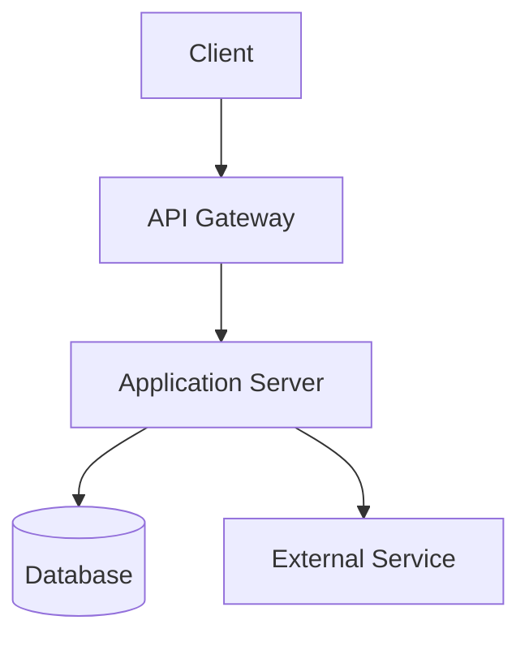
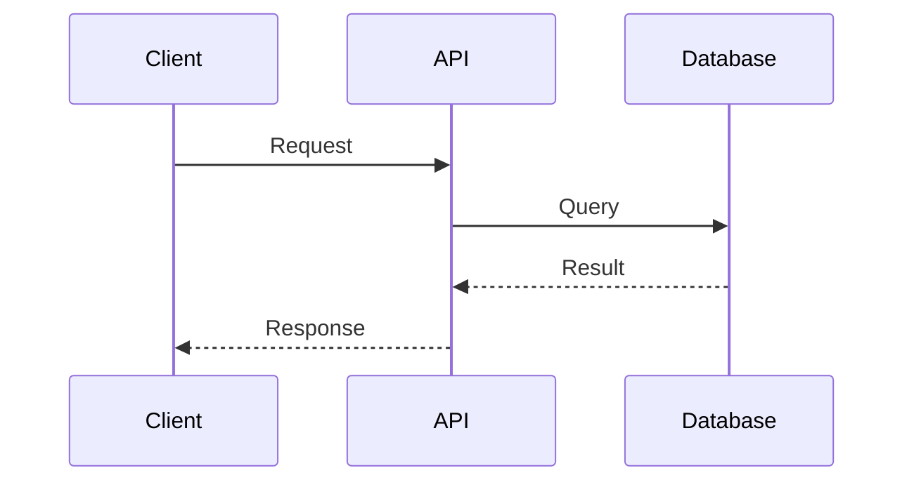

# Architecture Build Skill

Analyzes repository structure, detects technology patterns, and generates draft documentation following engineering best practices for repository documentation.

## When This Skill is Invoked

This skill is automatically invoked by the `architecture` agent during the BUILD phase to:
- Scan repository for existing documentation
- Detect technology stack and patterns
- Generate draft documentation for gaps
- Create ADRs for detected decisions
- **Assess and generate coding conventions** based on detected frameworks

## Purpose

Generates documentation that helps answer questions before they're asked:
1. What is this repository?
2. Why do key technical decisions exist?
3. How does data flow through the system?
4. How do I run, deploy, and operate this?
5. **What coding conventions should I follow?**

## Analysis Process

### Step 1: Scan Documentation Structure

**Find existing docs:**
```
Glob patterns:
- docs/**/*.md
- README.md
- CONTRIBUTING.md
- ARCHITECTURE.md
- api/**/*
- .github/workflows/*.yml
```

**Catalog findings:**
- List all markdown files in /docs
- Check README.md presence and size
- Find API specification files
- Locate CI/CD workflows
- Identify ADR directory

### Step 2: Detect Technology Stack

**Configuration file indicators:**

| File | Technology |
|------|------------|
| `package.json` | Node.js/JavaScript |
| `tsconfig.json` | TypeScript |
| `requirements.txt` | Python |
| `pyproject.toml` | Python (modern) |
| `go.mod` | Go |
| `Cargo.toml` | Rust |
| `pom.xml` | Java (Maven) |
| `build.gradle` | Java/Kotlin (Gradle) |
| `Gemfile` | Ruby |
| `composer.json` | PHP |
| `.csproj` | C#/.NET |

**Framework detection:**

| Pattern | Framework |
|---------|-----------|
| `express` in package.json | Express.js |
| `fastify` in package.json | Fastify |
| `@nestjs` in package.json | NestJS |
| `flask` in requirements | Flask |
| `django` in requirements | Django |
| `fastapi` in requirements | FastAPI |
| `gin-gonic` in go.mod | Gin |
| `fiber` in go.mod | Fiber |

### Step 3: Detect Architecture Patterns

**Directory structure analysis:**

| Pattern | Indicates |
|---------|-----------|
| `src/api/`, `src/controllers/` | API service |
| `src/workers/`, `src/jobs/` | Background processing |
| `src/services/`, `src/domain/` | Service layer pattern |
| `src/repositories/` | Repository pattern |
| `service-*/` directories | Microservices |
| `packages/` | Monorepo |

**Infrastructure indicators:**

| File/Pattern | Infrastructure |
|--------------|----------------|
| `docker-compose.yml` | Docker Compose |
| `Dockerfile` | Containerized |
| `kubernetes/`, `k8s/` | Kubernetes |
| `terraform/` | Terraform IaC |
| `serverless.yml` | Serverless Framework |
| `.github/workflows/` | GitHub Actions |
| `.gitlab-ci.yml` | GitLab CI |

### Step 4: Detect Database Choices

**Look for database indicators:**

| Pattern | Database |
|---------|----------|
| `pg`, `postgres` in deps | PostgreSQL |
| `mysql`, `mysql2` in deps | MySQL |
| `mongodb`, `mongoose` in deps | MongoDB |
| `redis` in deps | Redis |
| `prisma` in deps | Prisma ORM |
| `typeorm` in deps | TypeORM |
| `sequelize` in deps | Sequelize |
| `sqlalchemy` in deps | SQLAlchemy |

**Migration file locations:**
- `migrations/`
- `db/migrations/`
- `prisma/migrations/`

### Step 5: Detect External Services

**Grep for common integrations:**

| Import/Package | Service |
|----------------|---------|
| `stripe` | Stripe payments |
| `@sendgrid`, `sendgrid` | SendGrid email |
| `twilio` | Twilio SMS |
| `aws-sdk` | AWS services |
| `@google-cloud` | Google Cloud |
| `@azure` | Azure services |
| `@slack/web-api` | Slack integration |

### Step 6: Evaluate README Quality

**The Five Questions Check:**

1. **What is this?**
   - Look for: First paragraph, project description
   - Score: Present and clear = 1 point

2. **Why does it exist?**
   - Look for: Problem statement, purpose section
   - Score: Explains the problem = 1 point

3. **How do I run it locally?**
   - Look for: Quick start, installation, getting started
   - Score: Copy-paste commands present = 1 point

4. **How do I deploy it?**
   - Look for: Deployment section or link
   - Score: Clear deployment info = 1 point

5. **Who owns it?**
   - Look for: Team, contact, ownership section
   - Score: Owner identified = 1 point

**Scoring:**
- 5/5 = Excellent
- 4/5 = Good
- 3/5 = Needs work
- 2/5 = Poor
- 1/5 = Minimal
- 0/5 = Missing

### Step 7: Detect and Generate Coding Conventions

**Scan for existing conventions:**
```
Glob patterns:
- docs/conventions/**/*.md
- .eslintrc*, .prettierrc*, eslint.config.*
- pyproject.toml, setup.cfg, .flake8, .black
- .golangci.yml, .golangci.yaml
- .editorconfig
- CONTRIBUTING.md (code standards section)
```

**Detect linter/formatter configurations:**

| Config File | Tool | Standards Source |
|-------------|------|------------------|
| `.eslintrc.*` | ESLint | JavaScript/TypeScript rules |
| `.prettierrc.*` | Prettier | Code formatting |
| `eslint.config.*` | ESLint (flat config) | JavaScript/TypeScript rules |
| `pyproject.toml` | Black, Ruff, isort | Python formatting/linting |
| `.flake8` | Flake8 | Python linting |
| `.golangci.yml` | golangci-lint | Go linting |
| `rustfmt.toml` | rustfmt | Rust formatting |

**Extract framework-specific conventions:**

Based on detected frameworks, generate appropriate conventions:

| Framework | Convention Categories |
|-----------|----------------------|
| React | Component patterns, hooks, state management |
| Express/Fastify | Middleware, error handling, routing |
| NestJS | Modules, decorators, dependency injection |
| Django | Models, views, serializers, migrations |
| FastAPI | Pydantic models, dependency injection, routers |
| Spring Boot | Controllers, services, repositories |
| Gin/Fiber | Handlers, middleware, routing |

**Generate conventions structure:**

```
docs/
└── conventions/
    ├── README.md                    # Overview and how conventions are used
    ├── coding-standards.md          # Language and framework standards
    ├── testing-conventions.md       # Test patterns, naming, coverage
    └── naming-conventions.md        # File, variable, component naming
```

**Conventions Assessment Output:**

```markdown
## Conventions Analysis

### Existing Conventions

| Source | Type | Coverage |
|--------|------|----------|
| .eslintrc.js | Linting | JavaScript/TypeScript |
| .prettierrc | Formatting | All files |
| CONTRIBUTING.md | General | Partial |
| docs/conventions/ | Missing | N/A |

### Framework-Specific Standards Needed

Based on detected stack ([Framework]), the following conventions are recommended:

| Category | Standard | Source |
|----------|----------|--------|
| [category] | [standard] | [framework docs] |
| [category] | [standard] | [framework docs] |

### Generated Conventions

[List of convention files to be generated]
```

## Draft Generation

### ARCHITECTURE.md Template

```markdown
# System Architecture

## Overview

[Project name] is a [type of system] that [primary purpose].

## Technology Stack

| Component | Technology | Purpose |
|-----------|------------|---------|
| Runtime | [detected] | [purpose] |
| Framework | [detected] | [purpose] |
| Database | [detected] | [purpose] |
| Cache | [detected if any] | [purpose] |

## System Components



## Data Flow

### Critical Path: [Primary Use Case]



## Integration Points

| External Service | Purpose | Failure Mode |
|------------------|---------|--------------|
| [detected] | [inferred] | [ask team] |

## Key Decisions

See `/docs/architecture/decisions/` for Architecture Decision Records.

---

> **Note:** This document was auto-generated. Please review and expand.
```

### ADR Template

```markdown
# ADR-NNN: [Decision Title]

## Status

Accepted (inferred from codebase - please verify)

## Context

> **Note:** This context is inferred from codebase analysis.
> Please expand with actual decision history.

[Inferred context based on detected patterns]

## Decision

[Statement of the decision based on what was detected]

**Evidence from codebase:**
- [File or pattern that indicates this decision]
- [Another indicator]

## Consequences

**Positive (assumed):**
- [Likely benefit 1]
- [Likely benefit 2]

**Negative (assumed):**
- [Likely trade-off 1]
- [Likely trade-off 2]

## Date

[Earliest relevant commit date if detectable, otherwise current date]

---

> **Team Action Required:** Please verify this ADR reflects the actual
> decision-making process and add any missing context.
```

### CONTRIBUTING.md Template

```markdown
# Contributing to [Project Name]

## Development Setup

### Prerequisites

- [Detected runtime] version [detected version]
- [Detected database] (local or Docker)

### Getting Started

```bash
# Clone the repository
git clone [repo-url]
cd [repo-name]

# Install dependencies
[detected install command]

# Start development server
[detected start command]
```

## Code Standards

See `/docs/conventions/` for detailed coding standards.

### Branch Naming

[Inferred from existing branches or conventional]

```
feature/description
bugfix/description
hotfix/description
```

### Commit Messages

[Inferred from commit history or conventional]

```
type(scope): description

# Examples:
feat(auth): add password reset flow
fix(api): handle null response from service
docs(readme): update installation steps
```

### Pull Requests

1. Create feature branch from `main`
2. Make changes with tests
3. Open PR with description
4. Request review
5. Merge after approval

## Testing

```bash
# Run all tests
[detected test command]

# Run with coverage
[detected coverage command if exists]
```

---

> **Note:** This document was auto-generated. Please review and customize.
```

### Conventions Templates

#### docs/conventions/README.md Template

```markdown
# Coding Conventions

This directory contains coding standards and conventions for this project.

## Purpose

Coding conventions ensure consistency across the codebase by:
1. **Documenting standards** - Based on detected frameworks and libraries
2. **Guiding development** - Referenced during code implementation
3. **Enabling AI assistance** - AI tools reference these for consistent code generation

## Directory Structure

```
conventions/
├── README.md                    # This file
├── coding-standards.md          # Language and framework-specific standards
├── testing-conventions.md       # Test patterns, naming, and coverage requirements
└── naming-conventions.md        # File, variable, and component naming rules
```

## How These Conventions Are Used

### During Development
- Review relevant convention files before implementing new features
- Follow patterns documented for your specific framework
- Reference testing conventions when writing tests

### With AI Assistance
- AI tools (Claude Code, etc.) read these files to understand project standards
- Code generation follows documented patterns
- Test creation uses documented testing conventions

## Customization

These conventions were auto-generated based on codebase analysis. Teams should:
1. Review and edit for accuracy
2. Add team-specific rules
3. Remove inapplicable standards
4. Keep updated as practices evolve

---

> **Generated by:** Architecture Build Skill
> **Last Updated:** [timestamp]
```

#### docs/conventions/coding-standards.md Template

```markdown
# Coding Standards

Framework and language-specific coding standards for this project.

## Detected Stack

| Component | Technology | Version | Confidence |
|-----------|------------|---------|------------|
| Language | [detected] | [version] | HIGH/MEDIUM/LOW |
| Framework | [detected] | [version] | HIGH/MEDIUM/LOW |
| Test Framework | [detected] | [version] | HIGH/MEDIUM/LOW |
| Linter | [detected] | [version] | HIGH/MEDIUM/LOW |

---

## General Standards

### Code Organization

| Rule | Description | Applies To |
|------|-------------|------------|
| Single Responsibility | Each file/module has one purpose | All |
| Dependency Direction | Dependencies point inward | All |
| Explicit Imports | No wildcard imports | All |

### Error Handling

| Rule | Description | Example |
|------|-------------|---------|
| Explicit Errors | Errors should be explicit, not silent | `throw new Error('...')` |
| Error Messages | Include context and action | `"Failed to save: invalid format"` |
| Error Boundaries | Catch at appropriate boundaries | API layer, service layer |

---

## [Framework]-Specific Standards

> **Auto-generated based on detected framework**

[Framework-specific conventions go here based on what was detected]

### Patterns

| Pattern | Use When | Example |
|---------|----------|---------|
| [pattern] | [use case] | [example] |

### Anti-Patterns to Avoid

| Anti-Pattern | Why Avoid | Alternative |
|--------------|-----------|-------------|
| [anti-pattern] | [reason] | [better approach] |

---

## Security Standards

### Input Validation

| Rule | Description | Implementation |
|------|-------------|----------------|
| Parameterized Queries | Never string concatenation | Use ORM or prepared statements |
| Input Sanitization | Validate all external input | Framework validators |
| Output Encoding | Prevent XSS | Framework auto-escaping |

---

## Linter Configuration

**Active Linters:**
- [Linter name] - [config file location]

**Key Rules:**
[Extract important rules from detected linter configs]

---

> **Generated by:** Architecture Build Skill
> **Last Updated:** [timestamp]
> **Review Status:** Pending team review
```

#### docs/conventions/testing-conventions.md Template

```markdown
# Testing Conventions

Test patterns, naming conventions, and coverage requirements for this project.

## Detected Test Stack

| Component | Technology | Location |
|-----------|------------|----------|
| Test Framework | [detected] | [path] |
| Test Runner | [detected] | [config] |
| Coverage Tool | [detected] | [config] |
| Mock Library | [detected] | [usage] |

---

## Test Structure

### Directory Layout

```
[detected test directory structure]
```

### File Naming

| Test Type | Naming Pattern | Example |
|-----------|----------------|---------|
| Unit Tests | [pattern] | [example] |
| Integration Tests | [pattern] | [example] |
| E2E Tests | [pattern] | [example] |

---

## Test Patterns

### Unit Tests

**Location:** `[detected location]`

**Pattern:**
```[language]
[Detected test pattern example from codebase]
```

**Naming Convention:**
- `test_[function]_[scenario]_[expected_result]`
- OR `should [expected behavior] when [condition]`

### Integration Tests

**Location:** `[detected location]`

**What to Test:**
- Component interactions
- Database operations
- External service calls (mocked)

### E2E Tests

**Location:** `[detected location]`

**What to Test:**
- Complete user flows
- Critical business paths
- Cross-system integrations

---

## Coverage Requirements

| Metric | Target | Current |
|--------|--------|---------|
| Line Coverage | [target]% | [detected]% |
| Branch Coverage | [target]% | [detected]% |
| Function Coverage | [target]% | [detected]% |

---

## Mock Strategies

### External Services

| Service Type | Mock Strategy | Example |
|--------------|---------------|---------|
| Database | [strategy] | [example] |
| HTTP APIs | [strategy] | [example] |
| File System | [strategy] | [example] |

---

## Test Commands

```bash
# Run all tests
[detected command]

# Run with coverage
[detected command]

# Run specific test file
[detected command]

# Watch mode
[detected command]
```

---

> **Generated by:** Architecture Build Skill
> **Last Updated:** [timestamp]
```

#### docs/conventions/naming-conventions.md Template

```markdown
# Naming Conventions

File, variable, and component naming rules for this project.

## Detected Patterns

Based on codebase analysis, the following naming patterns are in use:

---

## File Naming

### Source Files

| Type | Convention | Example |
|------|------------|---------|
| Components | [PascalCase/kebab-case] | [example] |
| Utilities | [camelCase/snake_case] | [example] |
| Types/Interfaces | [PascalCase] | [example] |
| Constants | [SCREAMING_SNAKE_CASE] | [example] |
| Test Files | [pattern].test.[ext] | [example] |

### Directory Structure

| Type | Convention | Example |
|------|------------|---------|
| Feature Modules | [pattern] | [example] |
| Shared Code | [pattern] | [example] |
| Assets | [pattern] | [example] |

---

## Variable Naming

### General Rules

| Type | Convention | Example |
|------|------------|---------|
| Variables | [camelCase/snake_case] | `userName`, `user_name` |
| Constants | [SCREAMING_SNAKE_CASE] | `MAX_RETRIES` |
| Private | [_prefix or #] | `_internal`, `#private` |
| Boolean | [is/has/should prefix] | `isActive`, `hasPermission` |

### [Language]-Specific

[Language-specific naming conventions based on detected stack]

---

## Function/Method Naming

| Type | Convention | Example |
|------|------------|---------|
| Actions | verb + noun | `getUser`, `createOrder` |
| Predicates | is/has/can + noun | `isValid`, `hasAccess` |
| Handlers | handle + event | `handleClick`, `handleSubmit` |
| Callbacks | on + event | `onSuccess`, `onError` |

---

## Component Naming (if applicable)

| Type | Convention | Example |
|------|------------|---------|
| Components | PascalCase | `UserProfile` |
| Hooks | use + noun | `useAuth`, `useFetch` |
| HOCs | with + noun | `withAuth`, `withLoading` |
| Contexts | [Name]Context | `AuthContext` |

---

## API Naming

| Type | Convention | Example |
|------|------------|---------|
| Endpoints | plural nouns | `/users`, `/orders` |
| Actions | verbs in path | `/users/:id/activate` |
| Query Params | camelCase | `?pageSize=10` |

---

## Database Naming

| Type | Convention | Example |
|------|------------|---------|
| Tables | [plural/singular]_[snake_case] | `users`, `order_items` |
| Columns | snake_case | `created_at`, `user_id` |
| Foreign Keys | [table]_id | `user_id` |
| Indexes | idx_[table]_[columns] | `idx_users_email` |

---

> **Generated by:** Architecture Build Skill
> **Last Updated:** [timestamp]
```

## Output Format

### Documentation Assessment Output

```markdown
## Documentation Analysis

### Existing Structure

| Path | Status | Quality |
|------|--------|---------|
| README.md | Found | [score]/5 |
| docs/ | [Found/Missing] | [notes] |
| docs/conventions/ | [Found/Missing] | [notes] |
| CONTRIBUTING.md | [Found/Missing] | [notes] |
| ARCHITECTURE.md | [Found/Missing] | [notes] |

### Technology Detection

| Aspect | Detected | Confidence |
|--------|----------|------------|
| Language | [language] | HIGH/MEDIUM/LOW |
| Framework | [framework] | HIGH/MEDIUM/LOW |
| Database | [database] | HIGH/MEDIUM/LOW |
| Infrastructure | [infra] | HIGH/MEDIUM/LOW |

### Conventions Detection

| Source | Type | Status |
|--------|------|--------|
| docs/conventions/ | Documentation | [Found/Missing] |
| [linter config] | Linting Rules | [Found/Missing] |
| [formatter config] | Formatting | [Found/Missing] |
| CONTRIBUTING.md | Code Standards | [Found/Partial/Missing] |

### Generated Drafts

[List of generated draft documents with paths]

**Including conventions:**
- docs/conventions/README.md
- docs/conventions/coding-standards.md
- docs/conventions/testing-conventions.md
- docs/conventions/naming-conventions.md

### Critical Questions

[Questions that need team answers]
```

## Best Practices for Draft Generation

### Always Include Disclaimers

Every generated document should include:

```markdown
> **Note to Engineering Team:** This document was auto-generated based on
> codebase analysis. Please review, correct, and expand this content.
```

### Flag Uncertainty

When making inferences:

```markdown
**Detected:** PostgreSQL database
**Confidence:** HIGH (explicit connection string found)

**Detected:** Microservices architecture
**Confidence:** MEDIUM (multiple service directories, but no service mesh config)

**Detected:** Event-driven communication
**Confidence:** LOW (queue library present but usage unclear)
```

### Ask Rather Than Assume

For ambiguous patterns:

```markdown
**Critical Question:** I detected both REST endpoints and GraphQL schema.
Which is the primary API pattern? Are both actively used?
```

### Provide Examples

When creating templates, include realistic examples:

```markdown
## Example ADR

See `docs/architecture/decisions/001-example.md` for the expected format.
```

## Error Handling

### No Package Manager Detected

```markdown
**Issue:** Could not detect package manager or technology stack.

**Checked for:**
- package.json (Node.js)
- requirements.txt (Python)
- go.mod (Go)
- [other standard files]

**Action Required:** Please specify the primary technology stack.
```

### Conflicting Signals

```markdown
**Issue:** Detected conflicting patterns.

**Finding 1:** Express.js server in /src
**Finding 2:** Next.js config in root

**Question:** Is this a Next.js app with custom Express middleware,
or two separate applications? Please clarify.
```

### Large Monorepo

```markdown
**Issue:** Detected monorepo with multiple packages/services.

**Found:**
- packages/api
- packages/web
- packages/shared

**Recommendation:** Generate per-package architecture docs.
Start with: [most recently modified or most dependencies]
```

## Integration

This skill works with:
- **architecture agent**: Primary invoker for repository assessment
- **adr-generator**: Shares ADR format standards
- **diagram-generator**: May invoke for complex Mermaid diagrams

**Conventions are consumed by:**
- **code-test-create**: Uses `docs/conventions/testing-conventions.md` for test patterns
- **code-build**: Uses `docs/conventions/coding-standards.md` for implementation standards
- **code agent**: Scans for conventions before starting TDD cycle

---

When invoked, this skill will analyze the repository structure, detect technology patterns with confidence levels, and generate draft documentation including coding conventions that serve as a starting point for the engineering team and guidance for AI-assisted development.
